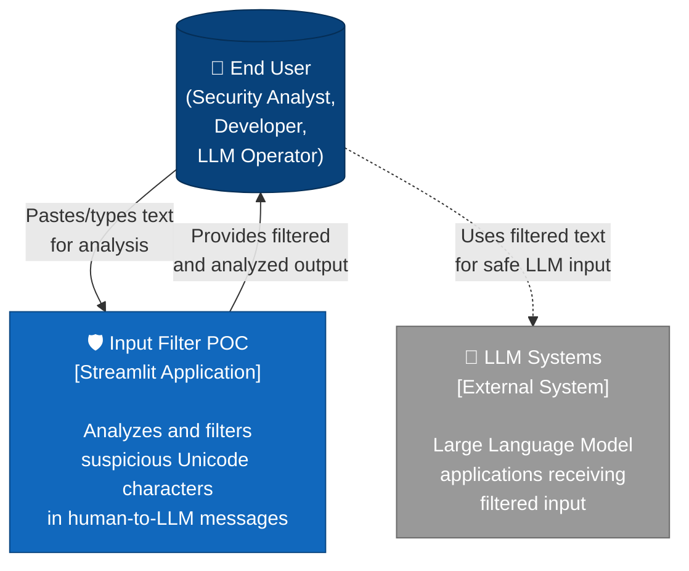
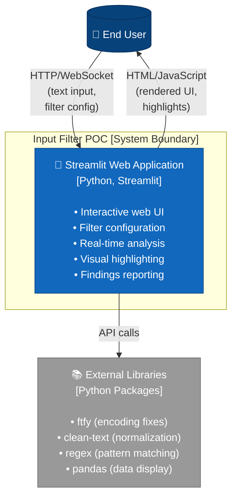
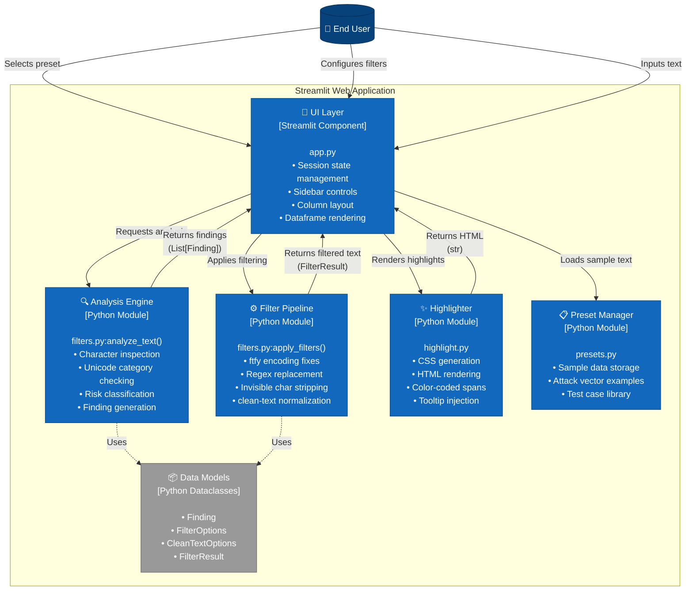
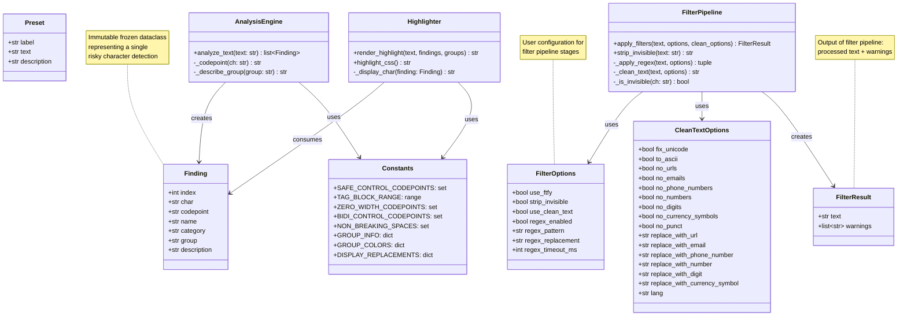
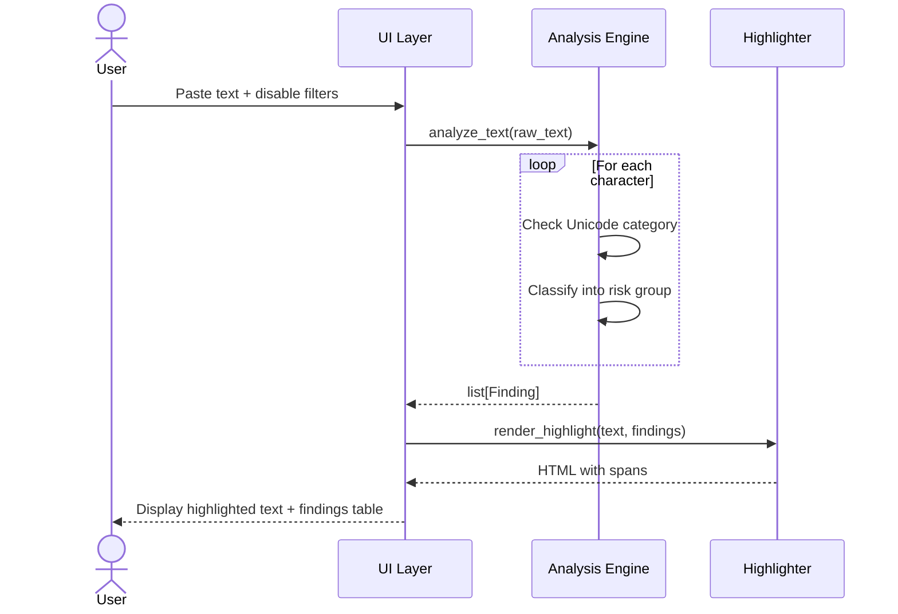
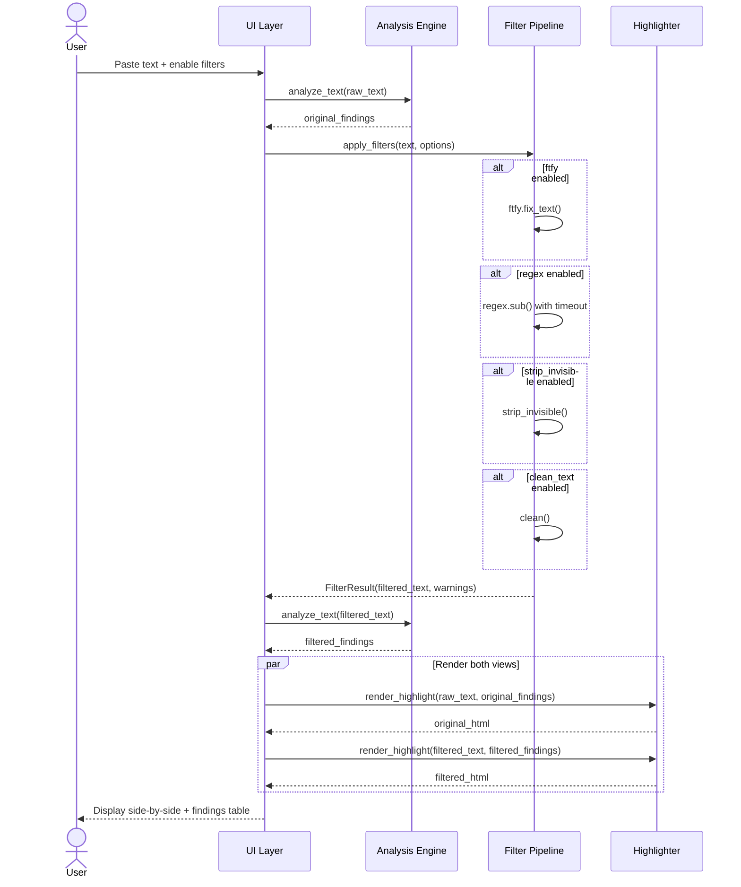
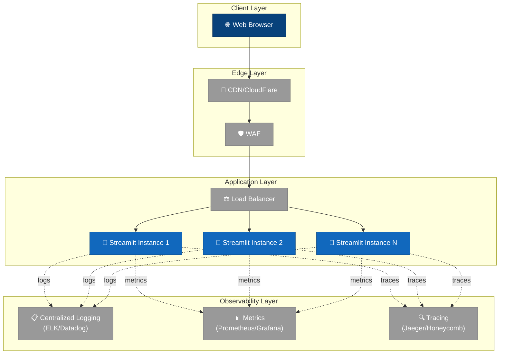

# Architecture Documentation

## Table of Contents

- [Overview](#overview)
- [C4 Model Diagrams](#c4-model-diagrams)
  - [Level 1: System Context](#level-1-system-context)
  - [Level 2: Container](#level-2-container)
  - [Level 3: Component](#level-3-component)
  - [Level 4: Code](#level-4-code)
- [Architecture Decisions](#architecture-decisions)
- [Technology Stack](#technology-stack)
- [Security Considerations](#security-considerations)
- [Data Flow](#data-flow)
- [Extension Points](#extension-points)

---

## Overview

**Input Filter POC** is a security-focused Streamlit application designed to detect and filter potentially malicious Unicode characters in human-to-LLM messages. The system addresses the growing concern of invisible character smuggling and prompt injection attacks by providing:

1. **Analysis**: Deep inspection of text to identify risky Unicode character classes
2. **Filtering**: Configurable pipeline to remove or normalize suspicious content
3. **Visualization**: Side-by-side comparison with highlighted suspicious characters
4. **Education**: Preset examples demonstrating common attack vectors

---

## C4 Model Diagrams

### Level 1: System Context

The system context shows how the Input Filter POC fits into the broader ecosystem of LLM-based applications.



**Key Relationships:**
- **User → System**: Provides untrusted text input for security analysis
- **System → User**: Returns filtered output, findings table, and visual highlights
- **User → LLM Systems**: Uses filtered output for safer LLM interactions (out of scope)

---

### Level 2: Container

The container diagram shows the single runtime container that comprises the system.



**Container Details:**

| Container | Technology | Responsibilities | Scaling Strategy |
|-----------|-----------|------------------|------------------|
| **Streamlit Web App** | Python 3.12+, Streamlit | UI rendering, filter orchestration, analysis execution | Single-user sessions; horizontal scaling via Streamlit Cloud |
| **External Libraries** | ftfy, clean-text, regex, pandas | Character normalization, pattern matching, data presentation | N/A (embedded) |

---

### Level 3: Component

The component diagram shows the internal architecture of the Streamlit Web Application.



**Component Responsibilities:**

| Component | File(s) | Key Functions | Dependencies |
|-----------|---------|---------------|--------------|
| **UI Layer** | `app.py` | `st.sidebar`, `st.columns`, session management | Streamlit, pandas |
| **Analysis Engine** | `filters.py` | `analyze_text()` | unicodedata, dataclasses |
| **Filter Pipeline** | `filters.py` | `apply_filters()`, `strip_invisible()`, `_apply_regex()` | ftfy, clean-text, regex |
| **Highlighter** | `highlight.py` | `render_highlight()`, `highlight_css()` | html.escape |
| **Preset Manager** | `presets.py` | `PRESETS` constant | dataclasses |
| **Data Models** | `filters.py` | `Finding`, `FilterOptions`, `CleanTextOptions`, `FilterResult` | dataclasses |

---

### Level 4: Code

The code diagram shows the key classes, functions, and their relationships at the implementation level.



**Key Design Patterns:**

1. **Immutable Data Classes**: All data models use `@dataclass(frozen=True)` for thread safety and predictability
2. **Pipeline Pattern**: Filters applied in sequence: ftfy → regex → strip_invisible → clean-text
3. **Separation of Concerns**: Analysis (detection) is independent from filtering (transformation)
4. **Constants Module Pattern**: Centralized Unicode character sets for maintainability

**Critical Functions:**

```python
# Core analysis function
def analyze_text(text: str) -> list[Finding]:
    """
    Scans every character in text and returns findings for risky characters.
    Detection is independent of filtering configuration.
    """

# Core filtering function
def apply_filters(
    text: str,
    options: FilterOptions,
    clean_options: CleanTextOptions | None = None,
) -> FilterResult:
    """
    Applies filter pipeline in order:
    1. ftfy (if enabled)
    2. Custom regex (if enabled, with timeout protection)
    3. Strip invisible characters (if enabled)
    4. clean-text normalization (if enabled)
    """

# Core rendering function
def render_highlight(
    text: str,
    findings: Iterable[Finding],
    enabled_groups: Iterable[str],
) -> str:
    """
    Generates HTML with <span> elements for flagged characters.
    Each span includes color coding and tooltip with Unicode metadata.
    """
```

---

## Architecture Decisions

### ADR-001: Single-Container Streamlit Application

**Status**: Accepted

**Context**: Need to rapidly prototype a security tool for Unicode analysis while maintaining ease of deployment and iteration.

**Decision**: Use Streamlit as the single application framework, combining UI, business logic, and presentation in one Python codebase.

**Consequences**:
- ✅ **Pros**: Rapid development, easy deployment, low complexity, built-in session state
- ⚠️ **Cons**: Limited scalability, coupled architecture, Streamlit-specific patterns

**Alternatives Considered**: Flask/FastAPI + React (rejected: overkill for POC), Jupyter Notebook (rejected: poor UX for end users)

---

### ADR-002: Analysis Before Filtering

**Status**: Accepted

**Context**: Users need to understand what's in the original text regardless of filter settings.

**Decision**: Always analyze the original text first, then apply filters separately. The findings table always reflects the original input, even when filters are disabled.

**Consequences**:
- ✅ **Pros**: Consistent detection, educational value, no hidden risks
- ⚠️ **Cons**: Slight performance overhead (double scanning), potential user confusion

---

### ADR-003: Ordered Filter Pipeline

**Status**: Accepted

**Context**: Filter order affects results. For example, ftfy might introduce non-ASCII characters that need subsequent filtering.

**Decision**: Enforce strict pipeline order:
1. `ftfy` (fix encoding)
2. Custom regex (user-defined transformations)
3. `strip_invisible` (remove control/format characters)
4. `clean-text` (normalization and structured data removal)

**Consequences**:
- ✅ **Pros**: Predictable behavior, composable filters, handles edge cases (e.g., ftfy → non-ASCII)
- ⚠️ **Cons**: Order is non-negotiable, may not fit all use cases

---

### ADR-004: Regex Timeout Protection

**Status**: Accepted

**Context**: User-provided regex patterns could cause catastrophic backtracking (ReDoS attacks).

**Decision**: Enforce configurable timeout (default 50ms) on custom regex operations using the `regex` module's timeout feature.

**Consequences**:
- ✅ **Pros**: Prevents UI hangs, protects against ReDoS, user-configurable
- ⚠️ **Cons**: Requires `regex` module instead of stdlib `re`, timeout errors need handling

---

### ADR-005: Frozen Dataclasses for Data Models

**Status**: Accepted

**Context**: Need immutable, type-safe data structures for configuration and results.

**Decision**: Use `@dataclass(frozen=True)` for all data models (`Finding`, `FilterOptions`, `CleanTextOptions`, `FilterResult`, `Preset`).

**Consequences**:
- ✅ **Pros**: Immutability prevents accidental mutations, better IDE support, hashable types
- ⚠️ **Cons**: Slightly more verbose updates (requires `dataclasses.replace()`), Python 3.7+ required

---

## Technology Stack

### Core Technologies

| Component | Technology | Version | Purpose |
|-----------|-----------|---------|---------|
| **Runtime** | Python | 3.12+ | Application language |
| **UI Framework** | Streamlit | Latest | Web interface |
| **Encoding Repair** | ftfy | Latest | Fix mojibake and Unicode corruption |
| **Text Cleaning** | clean-text | Latest | Remove URLs, emails, phones, normalize text |
| **Pattern Matching** | regex | Latest | Unicode-aware regex with timeout support |
| **Data Display** | pandas | Latest | Findings table rendering |
| **Package Manager** | uv | Latest | Fast, modern Python package management |

### Key Dependencies

```toml
[project]
name = "poc-input-filters"
version = "0.1.0"
requires-python = ">=3.12"
dependencies = [
    "streamlit",
    "ftfy",
    "clean-text",
    "regex",
    "pandas",
]
```

### Development Tools

- **Formatter**: ruff (implicit via modern-python skill)
- **Type Checker**: pyright/mypy (recommended but not enforced in POC)
- **Test Framework**: pytest (not yet implemented)

---

## Security Considerations

### Input Validation

**Current State**: The application is designed to handle **untrusted input**, as its primary purpose is analyzing potentially malicious text.

**Protections**:
1. **HTML Escaping**: All user input is escaped using `html.escape()` before rendering
2. **Regex Timeout**: Custom regex has a configurable timeout to prevent ReDoS attacks
3. **No Code Execution**: No `eval()`, `exec()`, or dynamic imports of user data
4. **Streamlit Sandboxing**: Streamlit's `unsafe_allow_html` is only used for **trusted** spans generated by the application

### Known Limitations

1. **Client-Side Rendering**: Highlighting is rendered on the client; malicious Unicode could potentially affect user's browser rendering engine (XSS via Unicode exploits is unlikely but theoretically possible)
2. **No Rate Limiting**: As a POC, there's no rate limiting on analysis requests
3. **Session State**: Session state is ephemeral; no persistent storage or user authentication

### Recommended Mitigations for Production

1. **Content Security Policy (CSP)**: Deploy with strict CSP headers
2. **Rate Limiting**: Implement per-IP or per-session rate limiting
3. **Audit Logging**: Log all analysis requests for security monitoring
4. **Input Size Limits**: Enforce maximum text length (e.g., 100KB)
5. **Sandboxed Execution**: Run in isolated container (Docker/K8s)

### OWASP Top 10 for LLM Applications (2025)

This tool addresses several OWASP LLM risks:

| OWASP Risk | How This Tool Mitigates |
|------------|-------------------------|
| **LLM01: Prompt Injection** | Detects and filters invisible characters commonly used in prompt injection attacks (zero-width, bidi controls, tag blocks) |
| **LLM03: Training Data Poisoning** | N/A (no training data handling) |
| **LLM04: Model Denial of Service** | Helps prevent crafted inputs with invisible tokens that could inflate context length |
| **LLM06: Sensitive Information Disclosure** | Detects hidden characters that could exfiltrate data via invisible text |

---

## Data Flow

### Analysis Flow (No Filtering)



### Filtering Flow (With Filters Enabled)



---

## Extension Points

### Adding New Character Groups

To detect a new category of risky characters:

1. **Update constants** in `filters.py`:
   ```python
   NEW_GROUP_CODEPOINTS = {0x1234, 0x5678}  # Add codepoints
   GROUP_INFO["new_group"] = "Description of new group"
   ```

2. **Update detection logic** in `analyze_text()`:
   ```python
   elif cp in NEW_GROUP_CODEPOINTS:
       group = "new_group"
   ```

3. **Update highlighting** in `highlight.py`:
   ```python
   GROUP_COLORS["new_group"] = ("#hexcolor", "#textcolor")
   DISPLAY_REPLACEMENTS["new_group"] = "[NEW]"
   DEFAULT_GROUPS.append("new_group")
   ```

### Adding New Filters

To add a new filter stage:

1. **Create filter function** in `filters.py`:
   ```python
   def new_filter(text: str, options: SomeOptions) -> str:
       # Transform text
       return transformed
   ```

2. **Update FilterOptions** dataclass:
   ```python
   @dataclass(frozen=True)
   class FilterOptions:
       # ... existing fields
       use_new_filter: bool = False
       new_filter_param: str = "default"
   ```

3. **Add to pipeline** in `apply_filters()`:
   ```python
   if options.use_new_filter:
       output = new_filter(output, options)
   ```

4. **Update UI** in `app.py`:
   ```python
   use_new_filter = st.sidebar.checkbox("Enable new filter", value=False)
   ```

### Adding New Presets

To add sample text for testing:

1. **Update `presets.py`**:
   ```python
   PRESETS.append(
       Preset(
           label="New Attack Vector",
           text="Sample text with suspicious characters",
           description="Description of the attack technique",
       )
   )
   ```

### API-ification

To convert this POC into an API service:

1. **Replace Streamlit** with FastAPI/Flask:
   ```python
   @app.post("/analyze")
   def analyze_endpoint(request: AnalyzeRequest):
       findings = analyze_text(request.text)
       return {"findings": [asdict(f) for f in findings]}

   @app.post("/filter")
   def filter_endpoint(request: FilterRequest):
       result = apply_filters(
           request.text,
           FilterOptions(**request.options),
       )
       return asdict(result)
   ```

2. **Add authentication** (JWT, API keys)
3. **Add rate limiting** (e.g., slowapi, Flask-Limiter)
4. **Containerize** with Docker
5. **Add OpenAPI documentation** (Swagger)

---

## Deployment Architecture (Future)

For production deployment, consider this evolution:



---

## Glossary

| Term | Definition |
|------|------------|
| **Bidi Controls** | Bidirectional text control characters (U+202A-202E, U+2066-2069) that change text rendering direction |
| **C4 Model** | Context, Containers, Components, Code - a hierarchical software architecture diagramming approach |
| **Clean-text** | Python library for text normalization (URL/email removal, Unicode fixes, etc.) |
| **Combining Mark** | Unicode characters (category Mn/Mc/Me) that modify preceding glyphs |
| **Finding** | A detected instance of a risky character in analyzed text |
| **ftfy** | "Fixes Text For You" - Python library for repairing broken Unicode and mojibake |
| **Mojibake** | Garbled text resulting from character encoding mismatch |
| **Non-breaking Space** | Whitespace characters (U+00A0, U+2007, U+202F) that prevent line breaks |
| **Prompt Injection** | Security attack where malicious instructions are embedded in LLM prompts |
| **ReDoS** | Regular Expression Denial of Service - attack using pathological regex patterns |
| **Tag Block** | Unicode range (U+E0000-E007F) for invisible tag characters |
| **Zero-width** | Invisible Unicode characters (U+200B-200D, U+2060, U+FEFF) with zero display width |

---

## References

- [C4 Model](https://c4model.com/) - Simon Brown's architecture diagramming approach
- [OWASP Top 10 for LLM Applications 2025](https://owasp.org/www-project-top-10-for-large-language-model-applications/)
- [Unicode Standard](https://unicode.org/standard/standard.html) - Character encoding reference
- [Streamlit Documentation](https://docs.streamlit.io/) - UI framework
- [ftfy Documentation](https://ftfy.readthedocs.io/) - Text repair library
- [clean-text PyPI](https://pypi.org/project/clean-text/) - Text normalization library

---

**Document Version**: 1.0
**Last Updated**: February 16, 2026
**Maintained By**: Development Team
