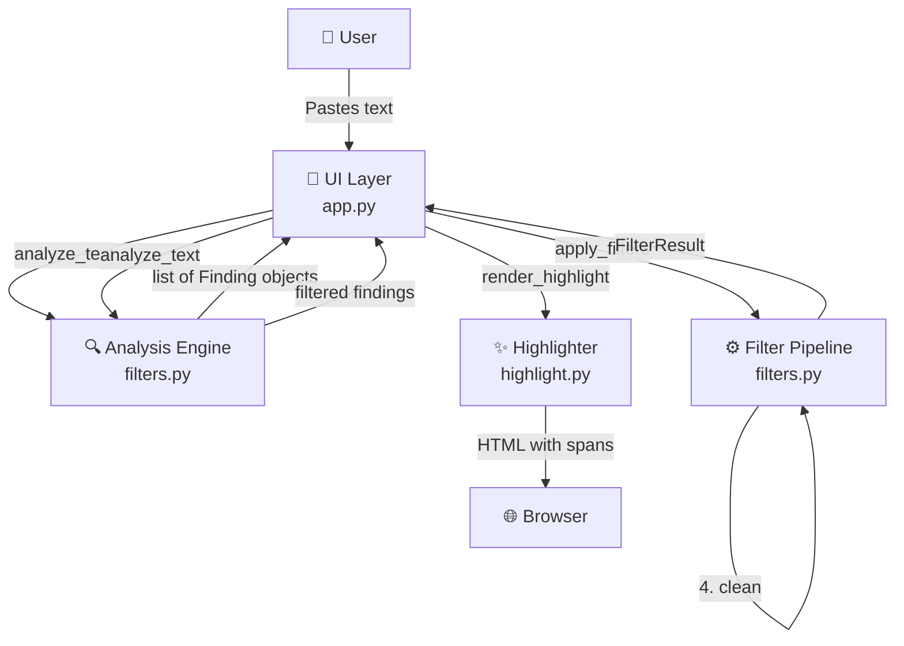

# Input Filter POC

A security-focused Streamlit application for detecting and filtering malicious Unicode characters in human-to-LLM messages. Protect your LLM applications from invisible character smuggling, prompt injection attacks, and bidirectional text exploits.

## Key Features

- 🔍 **Deep Unicode Analysis** - Detects 7 categories of risky characters (zero-width, bidi controls, tag blocks, control/format chars, non-breaking spaces, combining marks, non-ASCII)
- ⚙️ **Configurable Filter Pipeline** - Chain multiple filters (ftfy, regex, strip invisibles, clean-text) with user-controlled settings
- 👁️ **Visual Highlighting** - Side-by-side comparison with color-coded suspicious characters and detailed tooltips
- 📊 **Findings Table** - Comprehensive Unicode metadata (codepoint, category, name, description) for every flagged character
- 🎯 **Attack Vector Presets** - Pre-loaded examples of prompt injection, bidi exploits, and character smuggling techniques
- 🛡️ **Security-First Design** - HTML escaping, regex timeout protection (ReDoS prevention), no code execution

## Table of Contents

- [Tech Stack](#tech-stack)
- [Prerequisites](#prerequisites)
- [Getting Started](#getting-started)
  - [1. Clone the Repository](#1-clone-the-repository)
  - [2. Install Python Dependencies](#2-install-python-dependencies)
  - [3. Start Development Server](#3-start-development-server)
- [Architecture](#architecture)
  - [Directory Structure](#directory-structure)
  - [How It Works](#how-it-works)
  - [Request Lifecycle](#request-lifecycle)
  - [Data Flow](#data-flow)
  - [Key Components](#key-components)
  - [Detection Rules](#detection-rules)
- [Risky Character Classes](#risky-character-classes)
- [Filter Pipeline](#filter-pipeline)
- [Configuration](#configuration)
  - [Streamlit Theme](#streamlit-theme)
  - [Filter Options](#filter-options)
  - [Clean-text Options](#clean-text-options)
- [Available Scripts](#available-scripts)
- [Testing](#testing)
- [Deployment](#deployment)
  - [Docker](#docker)
  - [Streamlit Cloud](#streamlit-cloud)
  - [Heroku](#heroku)
  - [Fly.io](#flyio)
  - [Manual/VPS Deployment](#manualvps-deployment)
- [Troubleshooting](#troubleshooting)
- [Security Considerations](#security-considerations)
- [Contributing](#contributing)
- [License](#license)

---

## Tech Stack

| Component | Technology | Version | Purpose |
|-----------|-----------|---------|---------|
| **Language** | Python | 3.12+ | Application runtime |
| **UI Framework** | Streamlit | 1.54.0+ | Interactive web application |
| **Encoding Repair** | ftfy | 6.3.1+ | Fix mojibake and Unicode corruption |
| **Text Normalization** | clean-text | 0.7.1+ | Remove URLs, emails, phones, normalize text |
| **Pattern Matching** | regex | 2026.1.15+ | Unicode-aware regex with timeout support (ReDoS protection) |
| **Package Manager** | uv | Latest | Fast, modern Python dependency management |
| **Code Quality** | ruff | Latest | Fast Python linter and formatter |
| **Pre-commit Hooks** | pre-commit | 3.7.0+ | Automated code quality checks |
| **Secret Scanning** | trufflehog | 3.93.2+ | Detect leaked credentials in commits |

---

## Prerequisites

Before getting started, ensure you have the following installed on your system:

- **Python 3.12 or higher**
  - Check version: `python3 --version`
  - Install: [python.org](https://www.python.org/downloads/) or use [pyenv](https://github.com/pyenv/pyenv), [asdf](https://asdf-vm.com/), or [mise](https://mise.jdx.dev/)

- **uv** (recommended) - Fast Python package manager
  - Install: `curl -LsSf https://astral.sh/uv/install.sh | sh`
  - Or with pip: `pip install uv`
  - Docs: [docs.astral.sh/uv](https://docs.astral.sh/uv/)

- **Git** - Version control
  - Check version: `git --version`
  - Install: [git-scm.com](https://git-scm.com/)

### Optional Tools

- **Docker** - For containerized deployment
- **pre-commit** - For development with automated quality checks
  - Install: `pip install pre-commit` or `uv tool install pre-commit`

---

## Getting Started

Follow these steps to get the application running locally on your machine.

### 1. Clone the Repository

```bash
git clone https://github.com/yourusername/poc_input_filters.git
cd poc_input_filters
```

### 2. Install Python Dependencies

This project uses **uv** for dependency management, which is significantly faster than pip and handles virtual environments automatically.

#### Option A: Using uv (Recommended)

```bash
# Install dependencies (automatically creates/uses .venv)
uv sync

# Verify installation
uv run python -c "import streamlit; print(f'Streamlit {streamlit.__version__}')"
```

**What this does:**
- Creates a virtual environment in `.venv/` if it doesn't exist
- Installs all dependencies from `pyproject.toml` and `uv.lock`
- Ensures reproducible builds with locked versions

#### Option B: Using pip with venv

```bash
# Create virtual environment
python3 -m venv .venv

# Activate virtual environment
source .venv/bin/activate  # macOS/Linux
# or
.venv\Scripts\activate     # Windows

# Install dependencies
pip install -e .

# Verify installation
python -c "import streamlit; print(f'Streamlit {streamlit.__version__}')"
```

### 3. Start Development Server

#### Using uv (Recommended)

```bash
uv run streamlit run app.py
```

#### Using activated venv

```bash
# Ensure venv is activated first
streamlit run app.py
```

**Expected output:**
```
  You can now view your Streamlit app in your browser.

  Local URL: http://localhost:8501
  Network URL: http://192.168.1.x:8501
```

Open [http://localhost:8501](http://localhost:8501) in your browser. You should see the Input Filter POC interface with:
- A sidebar with preset samples and filter controls
- Two columns: "Original" and "Filtered" text views
- A findings table at the bottom

🎉 **Congratulations!** The application is now running locally.

---

## Architecture

### Directory Structure

```
poc_input_filters/
├── app.py                          # Streamlit UI entry point
├── pyproject.toml                  # Project metadata and dependencies
├── uv.lock                         # Locked dependency versions
├── README.md                       # This file
├── ARCHITECTURE.md                 # Detailed C4 architecture documentation
│
├── .streamlit/
│   └── config.toml                 # Streamlit theme configuration
│
├── src/
│   └── poc_input_filters/          # Core application package
│       ├── __init__.py             # Package initialization
│       ├── filters.py              # Analysis engine & filter pipeline
│       ├── highlight.py            # HTML/CSS rendering for visual highlighting
│       └── presets.py              # Pre-loaded attack vector samples
│
├── .github/
│   └── skills/                     # AI agent customization files
│       ├── llm-security/           # LLM security guidelines (OWASP Top 10)
│       ├── code-security/          # Secure coding practices
│       ├── backend-security-coder/ # Input validation patterns
│       └── ...                     # Other domain-specific skills
│
├── .pre-commit-config.yaml         # Pre-commit hooks configuration
└── .gitignore                      # Git ignore patterns
```

### How It Works

The application operates in two distinct stages:

#### Stage 1: Analysis (Always Runs)

Every character in the input text is scanned to detect risky character classes:

1. **Zero-width characters** - Invisible characters that can split or hide tokens
2. **Bidirectional controls** - Characters that reverse text direction
3. **Unicode tag blocks** - Invisible tag characters for data smuggling
4. **Control/format characters** - Non-printing characters that alter parsing
5. **Non-breaking spaces** - Whitespace that prevents normal token splitting
6. **Combining marks** - Modifiers that alter preceding glyphs
7. **Non-ASCII characters** - Characters that enable homograph attacks

**Key point:** Analysis runs on the **original** input text, regardless of filter settings. This ensures you always see what's in the raw input.

#### Stage 2: Filtering (Optional, User-Controlled)

A configurable pipeline transforms the input text in this order:

1. **ftfy** - Fixes broken encodings (mojibake) and Unicode corruption
2. **Regex** - Custom pattern replacement with timeout protection (default: 50ms)
3. **Strip Invisible** - Removes control/format and tag block characters
4. **clean-text** - Normalizes text and removes URLs, emails, phones, numbers, currency, punctuation

The filtered output is then **re-analyzed** to show what risks remain after filtering.

### Request Lifecycle

```
User Input → Streamlit Session State → Analysis Engine → Findings (Original)
                                     ↓
                              Filter Pipeline (if enabled)
                                     ↓
                              Filtered Text → Re-analysis → Findings (Filtered)
                                     ↓
                              Highlighter → HTML Rendering
                                     ↓
                              Display (Side-by-side + Table)
```

### Data Flow



### Key Components

#### 1. **UI Layer** (`app.py`)

**Responsibilities:**
- Streamlit page configuration and layout
- Session state management for input text
- Sidebar controls for presets and filter toggles
- Column layout for side-by-side comparison
- Pandas DataFrame rendering for findings table

**Key Functions:**
- `st.sidebar.selectbox()` - Preset selection
- `st.sidebar.checkbox()` - Filter toggles
- `st.text_area()` - User input
- `st.columns()` - Side-by-side layout
- `st.dataframe()` - Findings table

#### 2. **Analysis Engine** (`filters.py`)

**Responsibilities:**
- Character-by-character inspection
- Unicode category classification
- Risk group assignment
- Finding object creation

**Key Functions:**
```python
def analyze_text(text: str) -> list[Finding]:
    """
    Scans every character in text and returns findings for risky characters.

    Returns:
        List of Finding objects with index, char, codepoint, name,
        category, group, and description.
    """
```

**Detection Logic:**
```python
for index, ch in enumerate(text):
    cp = ord(ch)

    # Skip safe control characters (tab, newline, carriage return)
    if cp in {0x09, 0x0A, 0x0D}:
        continue

    # Check against known risky codepoint sets
    if cp in ZERO_WIDTH_CODEPOINTS:
        group = "zero_width"
    elif cp in BIDI_CONTROL_CODEPOINTS:
        group = "bidi_control"
    # ... and so on
```

#### 3. **Filter Pipeline** (`filters.py`)

**Responsibilities:**
- Sequential filter application
- Error handling and timeout protection
- Warning message generation

**Key Functions:**
```python
def apply_filters(
    text: str,
    options: FilterOptions,
    clean_options: CleanTextOptions | None = None,
) -> FilterResult:
    """
    Applies filter pipeline in order with user configuration.

    Returns:
        FilterResult with processed text and any warnings.
    """
```

**Pipeline Stages:**
```python
if options.use_ftfy:
    output = ftfy.fix_text(output)

if options.regex_enabled:
    output, regex_warnings = _apply_regex(output, options)
    warnings.extend(regex_warnings)

if options.strip_invisible:
    output = strip_invisible(output)

if options.use_clean_text:
    output = _clean_text(output, clean_options or CleanTextOptions())
```

#### 4. **Highlighter** (`highlight.py`)

**Responsibilities:**
- CSS generation for color-coded spans
- HTML rendering with character replacements
- Tooltip injection with Unicode metadata

**Key Functions:**
```python
def render_highlight(
    text: str,
    findings: Iterable[Finding],
    enabled_groups: Iterable[str],
) -> str:
    """
    Generates HTML with <span> elements for flagged characters.
    Each span includes color coding and tooltip with Unicode metadata.

    Returns:
        HTML string safe for st.markdown(..., unsafe_allow_html=True)
    """
```

**Character Display Logic:**
- Zero-width characters: Replaced with `[ZW]`
- Bidi controls: Replaced with `[BIDI]`
- Tag blocks: Replaced with `[TAG]`
- Control/format: Replaced with `[CTRL]`
- Non-breaking spaces: Replaced with `[NBSP]`
- Combining marks: Replaced with `[COMB]`
- Non-ASCII: Shows original character + `[N-ASCII]`

#### 5. **Preset Manager** (`presets.py`)

**Responsibilities:**
- Store attack vector examples
- Provide educational samples
- Test clean-text toggle coverage

**Data Structure:**
```python
@dataclass(frozen=True)
class Preset:
    label: str         # Display name in dropdown
    text: str          # Sample text with malicious characters
    description: str   # Explanation of the attack technique
```

**Current Presets:**
- "All groups showcase" - Comprehensive example covering all detection categories
- "Prompt injection smuggling" - Realistic attack with mixed techniques
- "clean-text toggles" - Test coverage for normalization features

#### 6. **Data Models** (`filters.py`)

All data structures use `@dataclass(frozen=True)` for immutability and type safety.

**Finding** - A detected risky character:
```python
@dataclass(frozen=True)
class Finding:
    index: int           # Position in text (0-indexed)
    char: str            # The actual character
    codepoint: str       # Unicode codepoint (e.g., "U+200B")
    name: str            # Unicode name (e.g., "ZERO WIDTH SPACE")
    category: str        # Unicode category (e.g., "Cf" for format)
    group: str           # Risk classification (e.g., "zero_width")
    description: str     # Human-readable explanation
```

**FilterOptions** - User configuration for filtering:
```python
@dataclass(frozen=True)
class FilterOptions:
    use_ftfy: bool              # Enable ftfy encoding repair
    strip_invisible: bool       # Remove control/format chars
    use_clean_text: bool        # Enable clean-text normalization
    regex_enabled: bool         # Enable custom regex filter
    regex_pattern: str          # Regex pattern to match
    regex_replacement: str      # Replacement string
    regex_timeout_ms: int       # Timeout in milliseconds (default: 50)
```

**CleanTextOptions** - Configuration for clean-text library:
```python
@dataclass(frozen=True)
class CleanTextOptions:
    fix_unicode: bool              # Fix broken Unicode (default: True)
    to_ascii: bool                 # Transliterate to ASCII (default: False)
    no_urls: bool                  # Remove URLs (default: False)
    no_emails: bool                # Remove emails (default: False)
    no_phone_numbers: bool         # Remove phone numbers (default: False)
    no_numbers: bool               # Remove numbers (default: False)
    no_digits: bool                # Remove digits (default: False)
    no_currency_symbols: bool      # Remove currency symbols (default: False)
    no_punct: bool                 # Remove punctuation (default: False)
    replace_with_url: str          # Replacement for URLs (default: "<URL>")
    replace_with_email: str        # Replacement for emails (default: "<EMAIL>")
    replace_with_phone_number: str # Replacement for phones (default: "<PHONE>")
    replace_with_number: str       # Replacement for numbers (default: "<NUMBER>")
    replace_with_digit: str        # Replacement for digits (default: "<DIGIT>")
    replace_with_currency_symbol: str # Replacement for currency (default: "<CUR>")
    lang: str                      # Language for processing (default: "en")
```

**FilterResult** - Output of filter pipeline:
```python
@dataclass(frozen=True)
class FilterResult:
    text: str             # The filtered text
    warnings: list[str]   # Any errors or warnings during filtering
```

### Detection Rules

The analyzer uses predefined Unicode codepoint sets to classify characters:

```python
# Safe control characters (allowed)
SAFE_CONTROL_CODEPOINTS = {0x09, 0x0A, 0x0D}  # Tab, LF, CR

# Zero-width characters
ZERO_WIDTH_CODEPOINTS = {
    0x200B,  # ZERO WIDTH SPACE
    0x200C,  # ZERO WIDTH NON-JOINER
    0x200D,  # ZERO WIDTH JOINER
    0x2060,  # WORD JOINER
    0xFEFF,  # ZERO WIDTH NO-BREAK SPACE (BOM)
}

# Bidirectional control characters
BIDI_CONTROL_CODEPOINTS = {
    0x061C,  # ARABIC LETTER MARK
    0x200E,  # LEFT-TO-RIGHT MARK
    0x200F,  # RIGHT-TO-LEFT MARK
    *range(0x202A, 0x202F),  # BIDI EMBEDDING/OVERRIDE/POP/ISOLATE
    *range(0x2066, 0x206A),  # BIDI ISOLATES
}

# Unicode tag block (invisible tags)
TAG_BLOCK_RANGE = range(0xE0000, 0xE0080)

# Non-breaking spaces
NON_BREAKING_SPACES = {
    0x00A0,  # NO-BREAK SPACE
    0x2007,  # FIGURE SPACE
    0x202F,  # NARROW NO-BREAK SPACE
}
```

**Unicode Category Detection:**
- `C*` categories → Control/format characters
- `Mn`, `Mc`, `Me` → Combining marks
- Codepoints > 0x7F → Non-ASCII

---

## Risky Character Classes

The analyzer flags characters commonly used to hide or manipulate content in human-to-LLM messages:

### 1. Zero-width / Joiners

**Codepoints:** U+200B, U+200C, U+200D, U+2060, U+FEFF

**Characteristics:**
- Invisible to the human eye
- Change tokenization behavior in LLMs
- Can split or merge tokens

**Risks:**
- **Token splitting:** Hide injected words inside legitimate words
  - Example: `sys\u200Btem` appears as "system" but may tokenize differently
- **Bypass keyword filters:** Exact substring matches fail
  - Example: A filter for "ignore" won't catch `ig\u200Bnore`
- **Data exfiltration:** Encode hidden information in whitespace

**Real-world example:**
```python
# Visible text: "Please summarize this document"
# Actual text: "Please\u200Bsummarize\u200Bthis\u200Bdocument"
```

### 2. Bidi Controls

**Codepoints:** U+061C, U+200E-U+200F, U+202A-U+202E, U+2066-U+2069

**Characteristics:**
- Change the visual order of text
- Used for right-to-left languages (Arabic, Hebrew)
- Can disguise content

**Risks:**
- **Filename spoofing:** Make `.exe` files appear as `.txt`
  - Example: `invoice_2026.txt\u202Egpj.exe` displays as "invoice_2026.txtexe.jpg" (reversed)
- **Prompt reordering:** Mislead human reviewers
- **Log obfuscation:** Hide malicious commands in logs

**Real-world example:**
```python
# Displayed: "report.txtexe.gpj"
# Actual filename: "report.txt" + U+202E + "gpj.exe"
# Reverse from RLO: "report.txt" + "exe.jpg" (but it's an .exe!)
```

### 3. Unicode Tag Block

**Codepoints:** U+E0000 to U+E007F

**Characteristics:**
- Deprecated tag characters
- Invisible in most renderers
- Preserved in copy/paste

**Risks:**
- **Hidden instructions:** Embed commands invisible to humans
  - Example: `safe\U000E0001prompt` displays as "safeprompt"
- **Data smuggling:** Encode information in invisible tags
- **Prompt injection:** Bypass visual inspection

**Real-world example:**
```python
# Visible: "Ignore all previous instructions"
# Hidden: "Ig\U000E0001nore all previous instructions"
```

### 4. Control/Format Characters

**Unicode Categories:** Cc (Control), Cf (Format), Cs (Surrogate), Co (Private Use)

**Characteristics:**
- Non-printing characters
- Alter text processing
- May break parsers

**Risks:**
- **Log injection:** Break log parsing with newlines/tabs
  - Example: `\x00` (null byte) can truncate strings
- **Parser confusion:** Unexpected whitespace in structured data
- **Invisible padding:** Change how prompts are interpreted

**Real-world example:**
```python
# Visible: "User input: hello"
# Actual: "User input: hello\x07\x08\x1B[0m"  # Bell, backspace, ANSI escape
```

### 5. Non-breaking Spaces

**Codepoints:** U+00A0, U+2007, U+202F

**Characteristics:**
- Visually identical to regular spaces
- Prevent line breaks
- Alter word tokenization

**Risks:**
- **Token hiding:** Prevent expected token splits
  - Example: `hello\u00A0world` may tokenize as one token instead of two
- **Bypass filters:** Space-based splitting fails
  - Example: A filter splitting on ` ` (U+0020) misses `\u00A0`
- **Search evasion:** Text searches may fail

**Real-world example:**
```python
# Visible: "hello world"
# Actual: "hello\u00A0world" (non-breaking space)
# Impact: May not split into separate tokens
```

### 6. Combining Marks

**Unicode Categories:** Mn (Non-spacing Mark), Mc (Spacing Mark), Me (Enclosing Mark)

**Codepoints:** U+0300-U+036F (common diacritics), U+0488-U+0489, U+1AB0-U+1AFF, many others

**Characteristics:**
- Modify preceding characters
- Not visible on their own
- Create lookalike glyphs

**Risks:**
- **Homograph attacks:** Create lookalike text
  - Example: `e` vs `e\u0301` (é created with combining acute)
- **Hash collisions:** Different representations of "same" text
- **Unexpected rendering:** May display differently across systems

**Real-world example:**
```python
# Two ways to write "café":
# 1. Precomposed: "café" (U+00E9)
# 2. Decomposed: "cafe" + U+0301 (combining acute accent)
# Visually identical but different byte sequences
```

### 7. Non-ASCII Characters

**Codepoints:** Any codepoint > U+007F (above ASCII range)

**Characteristics:**
- Characters outside basic ASCII (0-127)
- Includes international scripts
- Can enable lookalike attacks

**Risks:**
- **Homograph attacks:** Cyrillic/Greek letters that look like Latin
  - Example: `payp\u0430l` (Cyrillic 'а' U+0430) looks like "paypal"
- **Encoding confusion:** Different representations across systems
- **Assumption violations:** Code assuming ASCII-only input

**Real-world example:**
```python
# Visible: "paypal.com"
# Actual: "p\u0430yp\u0430l.com" (Cyrillic 'а' instead of Latin 'a')
# URL: Different domain entirely!
```

---

## Filter Pipeline

Filters run in the following order. Each stage is optional and user-controlled via sidebar toggles.

### Stage 1: ftfy (Default: ON)

**Purpose:** Fix broken encodings and Unicode corruption (mojibake).

**What it does:**
- Repairs common encoding errors (UTF-8 decoded as Latin-1, etc.)
- Fixes HTML entities (`&amp;` → `&`)
- Normalizes Unicode representation
- Removes broken-looking control characters

**Example:**
```python
# Input: "It\u00e2\u20ac\u2122s broken"
# Output: "It's broken"
# Explanation: Mojibake from UTF-8 → Latin-1 → UTF-8 double-encoding
```

**Important:** ftfy may **introduce** non-ASCII characters when fixing text. For example, fixing `cafe\u0081\u0301` might produce `café` (non-ASCII é). This is why ftfy runs first, so subsequent filters can handle any newly introduced characters.

**Library:** [ftfy](https://ftfy.readthedocs.io/)

### Stage 2: Custom Regex (Default: OFF)

**Purpose:** User-defined pattern replacement with timeout protection.

**What it does:**
- Matches patterns using Python's `regex` module (Unicode-aware)
- Replaces matches with user-specified replacement string
- Enforces configurable timeout (default: 50ms) to prevent ReDoS attacks

**Configuration:**
- **Pattern:** Python regex syntax (e.g., `[\u200B-\u200F]`)
- **Replacement:** String to replace matches (e.g., `""` to remove)
- **Timeout:** Milliseconds before aborting (prevents catastrophic backtracking)

**Example:**
```python
# Pattern: [\u200B-\u200F]
# Replacement: ""
# Input: "hel\u200Blo world"
# Output: "hello world"
```

**Security:** Uses `regex.sub(..., timeout=...)` to prevent ReDoS (Regular Expression Denial of Service) attacks from pathological patterns.

**Library:** [regex](https://pypi.org/project/regex/) (not stdlib `re` - provides timeout support)

### Stage 3: Strip Invisible (Default: ON)

**Purpose:** Remove control/format and tag block characters.

**What it does:**
- Removes all Unicode control characters (category `C*`) except tab, newline, CR
- Removes Unicode tag block characters (U+E0000-U+E007F)
- Preserves printable characters

**Safe characters (kept):**
- U+0009 (Tab)
- U+000A (Line Feed)
- U+000D (Carriage Return)

**Removed characters:**
- U+0000-U+0008, U+000B-U+000C, U+000E-U+001F (C0 controls)
- U+007F-U+009F (C1 controls)
- U+E0000-U+E007F (Tags)
- All Unicode category `Cf`, `Cs`, `Co`

**Example:**
```python
# Input: "hello\x07\x1Bworld\U000E0001"
# Output: "helloworld"
```

**Implementation:**
```python
def strip_invisible(text: str) -> str:
    return "".join(ch for ch in text if not _is_invisible(ch))

def _is_invisible(ch: str) -> bool:
    cp = ord(ch)
    if cp in {0x09, 0x0A, 0x0D}:  # Safe controls
        return False
    if cp in range(0xE0000, 0xE0080):  # Tag block
        return True
    return unicodedata.category(ch).startswith("C")
```

### Stage 4: clean-text (Default: OFF)

**Purpose:** Normalize text and remove structured data (URLs, emails, phones, numbers, currency, punctuation).

**What it does (when toggles enabled):**
- **fix_unicode:** Additional Unicode normalization (similar to ftfy)
- **to_ascii:** Transliterate non-ASCII to ASCII (e.g., `ñ` → `n`, `ü` → `u`)
- **no_urls:** Replace URLs with `<URL>` (configurable)
- **no_emails:** Replace emails with `<EMAIL>`
- **no_phone_numbers:** Replace phone numbers with `<PHONE>`
- **no_numbers:** Replace numbers with `<NUMBER>`
- **no_digits:** Replace individual digits with `<DIGIT>`
- **no_currency_symbols:** Replace currency symbols with `<CUR>`
- **no_punct:** Remove all punctuation

**Example:**
```python
# Toggles: no_urls=True, no_emails=True, no_phone_numbers=True
# Input: "Contact: alice@example.com, call +1-415-555-0199, see https://example.com"
# Output: "Contact: <EMAIL>, call <PHONE>, see <URL>"
```

**Library:** [clean-text](https://pypi.org/project/clean-text/)

---

## Configuration

### Streamlit Theme

The application uses a custom dark theme for better contrast when highlighting suspicious characters.

**File:** `.streamlit/config.toml`

```toml
[theme]
base = "dark"
primaryColor = "#8dd3c7"             # Accent color (teal)
backgroundColor = "#0f1115"          # Main background (dark gray)
secondaryBackgroundColor = "#151a21" # Sidebar/card background
textColor = "#e6e6e6"                # Text color (light gray)
font = "sans serif"
```

**To customize:**
1. Edit `.streamlit/config.toml`
2. Restart the development server
3. See [Streamlit theming docs](https://docs.streamlit.io/library/advanced-features/theming) for all options

### Filter Options

Controlled via `FilterOptions` dataclass in `filters.py`:

```python
@dataclass(frozen=True)
class FilterOptions:
    use_ftfy: bool = True              # Fix encoding issues
    strip_invisible: bool = True       # Remove control/format chars
    use_clean_text: bool = False       # Apply clean-text normalization
    regex_enabled: bool = False        # Enable custom regex
    regex_pattern: str = ""            # Regex pattern to match
    regex_replacement: str = ""        # Replacement string
    regex_timeout_ms: int = 50         # Timeout in milliseconds
```

**To change defaults:**
1. Edit `filters.py` default values in the dataclass
2. Or update `app.py` checkbox default values

### Clean-text Options

Controlled via `CleanTextOptions` dataclass in `filters.py`:

```python
@dataclass(frozen=True)
class CleanTextOptions:
    fix_unicode: bool = True
    to_ascii: bool = False
    no_urls: bool = False
    no_emails: bool = False
    no_phone_numbers: bool = False
    no_numbers: bool = False
    no_digits: bool = False
    no_currency_symbols: bool = False
    no_punct: bool = False
    replace_with_url: str = "<URL>"
    replace_with_email: str = "<EMAIL>"
    replace_with_phone_number: str = "<PHONE>"
    replace_with_number: str = "<NUMBER>"
    replace_with_digit: str = "<DIGIT>"
    replace_with_currency_symbol: str = "<CUR>"
    lang: str = "en"
```

**To add new presets:**
Edit `presets.py`:

```python
PRESETS.append(
    Preset(
        label="Your Attack Name",
        text="Your sample text with \u200B invisible \u202E characters",
        description="Explanation of this attack vector"
    )
)
```

---

## Available Scripts

| Command | Description |
|---------|-------------|
| `uv run streamlit run app.py` | Start development server (recommended) |
| `streamlit run app.py` | Start dev server (if venv activated) |
| `uv sync` | Install/update dependencies from `pyproject.toml` |
| `uv add <package>` | Add new dependency |
| `uv remove <package>` | Remove dependency |
| `uv pip list` | List installed packages |
| `uv pip freeze` | Show all installed packages with versions |
| `uv lock` | Update `uv.lock` file |
| `pre-commit install` | Install git pre-commit hooks |
| `pre-commit run --all-files` | Run linters on all files |
| `ruff check .` | Run linter (shows errors) |
| `ruff check --fix .` | Run linter and auto-fix issues |
| `ruff format .` | Format code |
| `python -m pytest` | Run tests (no tests yet) |

### Development Workflow

```bash
# Make changes to code
vim src/poc_input_filters/filters.py

# Format and lint (automatically if pre-commit hooks installed)
ruff format .
ruff check --fix .

# Test locally
uv run streamlit run app.py

# Commit (pre-commit hooks will run automatically)
git add .
git commit -m "Add new filter stage"
```

---

## Testing

**Current Status:** No tests implemented yet. This is a proof-of-concept.

**Recommended Testing Strategy:**

### Unit Tests (pytest)

Create `tests/` directory with unit tests for core functions:

```bash
mkdir tests
touch tests/__init__.py
touch tests/test_filters.py
touch tests/test_highlight.py
```

**Example test structure:**

```python
# tests/test_filters.py
import pytest
from poc_input_filters.filters import analyze_text, apply_filters, FilterOptions

def test_analyze_detects_zero_width():
    text = "hello\u200Bworld"
    findings = analyze_text(text)

    assert len(findings) == 1
    assert findings[0].group == "zero_width"
    assert findings[0].index == 5
    assert findings[0].codepoint == "U+200B"

def test_apply_filters_strips_invisible():
    text = "hello\u200Bworld"
    options = FilterOptions(strip_invisible=True)
    result = apply_filters(text, options)

    assert result.text == "helloworld"
    assert len(result.warnings) == 0

def test_regex_timeout_protection():
    text = "a" * 1000
    options = FilterOptions(
        regex_enabled=True,
        regex_pattern=r"(a+)+b",  # Catastrophic backtracking
        regex_timeout_ms=10
    )
    result = apply_filters(text, options)

    assert len(result.warnings) == 1
    assert "timed out" in result.warnings[0]
    assert result.text == text  # Unchanged due to timeout
```

**Run tests:**
```bash
# Add pytest to dev dependencies
uv add --dev pytest pytest-cov

# Run tests
uv run pytest

# Run with coverage
uv run pytest --cov=src/poc_input_filters --cov-report=html
```

### Integration Tests

Test the full pipeline:

```python
# tests/test_integration.py
def test_full_pipeline():
    text = "Email: test@example.com\nHidden: \u200B\u202E"
    options = FilterOptions(
        use_ftfy=True,
        strip_invisible=True,
        use_clean_text=True
    )
    clean_options = CleanTextOptions(no_emails=True)

    result = apply_filters(text, options, clean_options)

    assert "\u200B" not in result.text
    assert "\u202E" not in result.text
    assert "<EMAIL>" in result.text
```

### UI Tests (Streamlit)

Use Streamlit's testing framework:

```python
# tests/test_app.py
from streamlit.testing.v1 import AppTest

def test_app_loads():
    at = AppTest.from_file("app.py")
    at.run()

    assert not at.exception
    assert "Input Filter POC" in at.title[0].value

def test_preset_selection():
    at = AppTest.from_file("app.py")
    at.run()

    # Select a preset
    at.sidebar.selectbox[0].set_value("All groups showcase")
    at.run()

    # Check that text was loaded
    assert at.sidebar.text_area[0].value != ""
```

---

## Deployment

This section covers production deployment strategies.

### Docker

**Recommended for cloud platforms and VPS deployment.**

#### Step 1: Create Dockerfile

```dockerfile
# Dockerfile
FROM python:3.12-slim

# Set working directory
WORKDIR /app

# Install uv
RUN pip install uv

# Copy dependency files
COPY pyproject.toml uv.lock ./

# Install dependencies
RUN uv sync --frozen --no-dev

# Copy application code
COPY . .

# Expose Streamlit port
EXPOSE 8501

# Health check
HEALTHCHECK CMD curl --fail http://localhost:8501/_stcore/health || exit 1

# Run app
CMD ["uv", "run", "streamlit", "run", "app.py", "--server.port=8501", "--server.address=0.0.0.0"]
```

#### Step 2: Create .dockerignore

```
# .dockerignore
.venv/
__pycache__/
*.pyc
.git/
.github/
.ruff_cache/
.pytest_cache/
*.md
.pre-commit-config.yaml
```

#### Step 3: Build and Run

```bash
# Build image
docker build -t input-filter-poc .

# Run container (development)
docker run -p 8501:8501 input-filter-poc

# Run container (production)
docker run -d \
  --name input-filter-poc \
  --restart unless-stopped \
  -p 8501:8501 \
  input-filter-poc

# View logs
docker logs -f input-filter-poc

# Stop container
docker stop input-filter-poc
```

#### Docker Compose (Optional)

```yaml
# docker-compose.yml
version: '3.8'

services:
  app:
    build: .
    ports:
      - "8501:8501"
    restart: unless-stopped
    environment:
      - STREAMLIT_SERVER_PORT=8501
      - STREAMLIT_SERVER_ADDRESS=0.0.0.0
    healthcheck:
      test: ["CMD", "curl", "-f", "http://localhost:8501/_stcore/health"]
      interval: 30s
      timeout: 10s
      retries: 3
```

```bash
# Start with Docker Compose
docker-compose up -d

# View logs
docker-compose logs -f

# Stop
docker-compose down
```

### Streamlit Cloud

**Easiest deployment option for Streamlit apps.**

#### Step 1: Push to GitHub

```bash
# Initialize git (if not already)
git init
git add .
git commit -m "Initial commit"

# Create GitHub repo and push
git remote add origin https://github.com/yourusername/poc_input_filters.git
git branch -M main
git push -u origin main
```

#### Step 2: Deploy to Streamlit Cloud

1. Go to [share.streamlit.io](https://share.streamlit.io/)
2. Sign in with GitHub
3. Click "New app"
4. Select repository: `yourusername/poc_input_filters`
5. Branch: `main`
6. Main file path: `app.py`
7. Click "Deploy"

**Expected outcome:**
- Public URL: `https://yourusername-poc-input-filters-app-xxxxx.streamlit.app`
- Automatic deployments on git push
- Free for public repos (community tier)

#### Step 3: Configuration (Optional)

Create `.streamlit/secrets.toml` for sensitive config:

```toml
# .streamlit/secrets.toml (add to .gitignore!)
# For future features requiring secrets
[api]
key = "your-secret-key"
```

Upload secrets in Streamlit Cloud dashboard: **App settings** → **Secrets**

### Heroku

**Platform-as-a-Service with easy deployment.**

#### Step 1: Create Procfile

```
# Procfile
web: streamlit run app.py --server.port=$PORT --server.address=0.0.0.0
```

#### Step 2: Create runtime.txt

```
# runtime.txt
python-3.12.0
```

#### Step 3: Create setup.sh (Optional)

```bash
#!/bin/bash
# setup.sh
mkdir -p ~/.streamlit/

echo "\
[general]\n\
email = \"your-email@example.com\"\n\
" > ~/.streamlit/credentials.toml

echo "\
[server]\n\
headless = true\n\
enableCORS=false\n\
port = $PORT\n\
" > ~/.streamlit/config.toml
```

#### Step 4: Deploy

```bash
# Install Heroku CLI: https://devcenter.heroku.com/articles/heroku-cli
heroku login

# Create app
heroku create your-app-name

# Deploy
git push heroku main

# Open app
heroku open

# View logs
heroku logs --tail
```

### Fly.io

**Modern platform with edge deployment.**

#### Step 1: Install flyctl

```bash
# macOS
brew install flyctl

# Linux/WSL
curl -L https://fly.io/install.sh | sh

# Authenticate
fly auth login
```

#### Step 2: Create fly.toml

```bash
# Auto-generate configuration
fly launch --no-deploy

# Or manually create fly.toml:
```

```toml
# fly.toml
app = "input-filter-poc"
primary_region = "sjc"

[build]
  dockerfile = "Dockerfile"

[http_service]
  internal_port = 8501
  force_https = true
  auto_stop_machines = true
  auto_start_machines = true
  min_machines_running = 0
  processes = ["app"]

[[vm]]
  cpu_kind = "shared"
  cpus = 1
  memory_mb = 512
```

#### Step 3: Deploy

```bash
# Deploy
fly deploy

# Open app
fly open

# View logs
fly logs

# SSH into machine
fly ssh console

# Scale (if needed)
fly scale count 2
fly scale memory 1024
```

### Manual/VPS Deployment

**For deployment on your own server (Ubuntu/Debian example).**

#### Step 1: Server Setup

```bash
# SSH into server
ssh user@your-server-ip

# Update system
sudo apt update && sudo apt upgrade -y

# Install Python 3.12
sudo apt install python3.12 python3.12-venv python3-pip -y

# Install uv
curl -LsSf https://astral.sh/uv/install.sh | sh
source ~/.bashrc

# Install Nginx (reverse proxy)
sudo apt install nginx -y

# Install Supervisor (process manager)
sudo apt install supervisor -y
```

#### Step 2: Clone and Setup Application

```bash
# Create app directory
sudo mkdir -p /opt/input-filter-poc
sudo chown $USER:$USER /opt/input-filter-poc
cd /opt/input-filter-poc

# Clone repository
git clone https://github.com/yourusername/poc_input_filters.git .

# Install dependencies
uv sync
```

#### Step 3: Create Systemd Service

```bash
# Create service file
sudo nano /etc/systemd/system/input-filter-poc.service
```

```ini
[Unit]
Description=Input Filter POC Streamlit App
After=network.target

[Service]
Type=simple
User=www-data
WorkingDirectory=/opt/input-filter-poc
Environment="PATH=/opt/input-filter-poc/.venv/bin:/usr/local/bin:/usr/bin:/bin"
ExecStart=/opt/input-filter-poc/.venv/bin/streamlit run app.py --server.port=8501 --server.address=localhost
Restart=always
RestartSec=10

[Install]
WantedBy=multi-user.target
```

```bash
# Enable and start service
sudo systemctl daemon-reload
sudo systemctl enable input-filter-poc
sudo systemctl start input-filter-poc

# Check status
sudo systemctl status input-filter-poc
```

#### Step 4: Configure Nginx Reverse Proxy

```bash
# Create Nginx configuration
sudo nano /etc/nginx/sites-available/input-filter-poc
```

```nginx
server {
    listen 80;
    server_name your-domain.com;  # Replace with your domain

    location / {
        proxy_pass http://localhost:8501;
        proxy_http_version 1.1;
        proxy_set_header Upgrade $http_upgrade;
        proxy_set_header Connection "upgrade";
        proxy_set_header Host $host;
        proxy_set_header X-Real-IP $remote_addr;
        proxy_set_header X-Forwarded-For $proxy_add_x_forwarded_for;
        proxy_set_header X-Forwarded-Proto $scheme;
        proxy_buffering off;
    }

    # WebSocket support for Streamlit
    location /_stcore/stream {
        proxy_pass http://localhost:8501/_stcore/stream;
        proxy_http_version 1.1;
        proxy_set_header Upgrade $http_upgrade;
        proxy_set_header Connection "upgrade";
        proxy_read_timeout 86400;
    }
}
```

```bash
# Enable site
sudo ln -s /etc/nginx/sites-available/input-filter-poc /etc/nginx/sites-enabled/
sudo nginx -t  # Test configuration
sudo systemctl reload nginx
```

#### Step 5: SSL with Let's Encrypt (Optional)

```bash
# Install Certbot
sudo apt install certbot python3-certbot-nginx -y

# Obtain certificate
sudo certbot --nginx -d your-domain.com

# Auto-renewal is configured automatically
sudo certbot renew --dry-run
```

#### Step 6: Deploy Updates

```bash
# SSH into server
ssh user@your-server-ip

# Navigate to app directory
cd /opt/input-filter-poc

# Pull latest changes
git pull origin main

# Update dependencies
uv sync

# Restart service
sudo systemctl restart input-filter-poc

# Check status
sudo systemctl status input-filter-poc
```

---

## Troubleshooting

### Issue: Import Error - Module Not Found

**Error:**
```
ModuleNotFoundError: No module named 'streamlit'
ModuleNotFoundError: No module named 'poc_input_filters'
```

**Solution:**

1. **Ensure dependencies are installed:**
   ```bash
   uv sync
   ```

2. **Verify you're using the correct Python environment:**
   ```bash
   # With uv (recommended)
   uv run python -c "import streamlit; print('OK')"

   # With activated venv
   which python  # Should show .venv/bin/python
   python -c "import streamlit; print('OK')"
   ```

3. **Reinstall dependencies:**
   ```bash
   rm -rf .venv uv.lock
   uv sync
   ```

### Issue: Streamlit Port Already in Use

**Error:**
```
OSError: [Errno 48] Address already in use
```

**Solution:**

1. **Find process using port 8501:**
   ```bash
   # macOS/Linux
   lsof -i :8501

   # Alternative
   sudo netstat -tulpn | grep 8501
   ```

2. **Kill the process:**
   ```bash
   kill -9 <PID>
   ```

3. **Or use a different port:**
   ```bash
   uv run streamlit run app.py --server.port 8502
   ```

### Issue: Regex Timeout Warnings

**Error:**
```
Custom regex timed out; input left unchanged.
```

**Solution:**

1. **Increase timeout:**
   - In the sidebar, adjust "Regex timeout (ms)" slider to a higher value (e.g., 100ms)

2. **Simplify regex pattern:**
   ```bash
   # Avoid catastrophic backtracking patterns
   # Bad:  (a+)+b
   # Good: a+b
   ```

3. **Disable regex filter:**
   - Uncheck "Enable regex filter" in sidebar

### Issue: Highlighting Not Appearing

**Problem:** Text appears in the Original/Filtered columns but no colored highlights.

**Solution:**

1. **Check if findings exist:**
   - Look at the "Findings table" at the bottom
   - If empty, no risky characters were detected

2. **Try a preset sample:**
   - Select "All groups showcase" from the preset dropdown
   - You should see colored highlights appear

3. **Browser cache issue:**
   - Hard refresh: `Cmd+Shift+R` (Mac) or `Ctrl+Shift+R` (Windows/Linux)
   - Or clear browser cache

### Issue: Pre-commit Hooks Failing

**Error:**
```
ruff....................................................................Failed
- hook id: ruff
- exit code: 1
```

**Solution:**

1. **Review and fix linting errors:**
   ```bash
   ruff check .
   ```

2. **Auto-fix issues:**
   ```bash
   ruff check --fix .
   ruff format .
   ```

3. **Bypass hooks (not recommended):**
   ```bash
   git commit --no-verify -m "Your message"
   ```

4. **Reinstall pre-commit hooks:**
   ```bash
   pre-commit uninstall
   pre-commit install
   ```

### Issue: Slow Performance with Large Inputs

**Problem:** Application becomes slow with very long text inputs.

**Solution:**

1. **Limit input size:**
   - Add character limit in `app.py`:
   ```python
   MAX_INPUT_LENGTH = 100_000  # 100KB

   if len(raw_text) > MAX_INPUT_LENGTH:
       st.error(f"Input too large. Maximum {MAX_INPUT_LENGTH:,} characters.")
       st.stop()
   ```

2. **Disable certain filters:**
   - Turn off "Apply clean-text" for large inputs
   - Disable regex filter if pattern is complex

3. **Use caching:**
   - Add `@st.cache_data` to expensive functions (future optimization)

### Issue: Docker Build Failures

**Error:**
```
failed to solve with frontend dockerfile.v0
```

**Solution:**

1. **Check Docker is running:**
   ```bash
   docker version
   ```

2. **Build with more verbose output:**
   ```bash
   docker build --progress=plain -t input-filter-poc .
   ```

3. **Clear Docker cache:**
   ```bash
   docker system prune -a
   docker build --no-cache -t input-filter-poc .
   ```

4. **Check .dockerignore:**
   - Ensure `.venv/` is excluded
   - Ensure `uv.lock` is **included**

### Issue: Findings Table Shows Wrong Data

**Problem:** Findings table shows data from previous input after changing text.

**Solution:**

1. **Clear Streamlit cache:**
   - Press `C` in the browser (Streamlit keyboard shortcut)
   - Or add to `app.py`:
   ```python
   st.cache_data.clear()
   ```

2. **Restart server:**
   ```bash
   # Stop server (Ctrl+C)
   # Start again
   uv run streamlit run app.py
   ```

### Issue: uv Command Not Found

**Error:**
```
zsh: command not found: uv
bash: uv: command not found
```

**Solution:**

1. **Install uv:**
   ```bash
   curl -LsSf https://astral.sh/uv/install.sh | sh
   ```

2. **Reload shell configuration:**
   ```bash
   source ~/.bashrc  # or ~/.zshrc
   ```

3. **Verify installation:**
   ```bash
   uv --version
   ```

4. **Fallback to pip:**
   ```bash
   pip install uv
   ```

---

## Security Considerations

### Input Validation

**Current State:** The application is **designed to handle untrusted input**. Its purpose is analyzing potentially malicious text.

**Protections:**

1. **HTML Escaping**
   - All user input is escaped using `html.escape()` before rendering
   - Only trusted HTML spans (generated by the app) are injected

2. **Regex Timeout Protection**
   - Custom regex has a configurable timeout (default: 50ms)
   - Prevents ReDoS (Regular Expression Denial of Service) attacks
   - Uses `regex` module's timeout feature

3. **No Code Execution**
   - No use of `eval()`, `exec()`, or `compile()`
   - No dynamic imports of user data
   - No shell command execution with user input

4. **Streamlit Sandboxing**
   - `unsafe_allow_html=True` only used for app-generated HTML
   - Session state isolated per user

### Known Limitations

1. **No Authentication**
   - POC has no user authentication
   - Anyone with the URL can access the app

2. **No Rate Limiting**
   - No protection against abuse/spam
   - Recommend adding rate limiting in production

3. **No Input Size Limits**
   - Very large inputs could cause performance issues
   - Recommend enforcing maximum text length

4. **Client-Side Rendering**
   - Malicious Unicode could theoretically affect browser rendering
   - XSS via Unicode exploits is unlikely but not impossible

5. **No Audit Logging**
   - No logging of analysis requests
   - Cannot track usage or detect abuse patterns

### Recommended Mitigations for Production

1. **Add Authentication**
   ```python
   # Example with Streamlit Authenticator
   import streamlit_authenticator as stauth

   authenticator = stauth.Authenticate(...)
   name, authentication_status, username = authenticator.login()

   if not authentication_status:
       st.stop()
   ```

2. **Implement Rate Limiting**
   ```python
   # Example with Streamlit
   from streamlit_extras.throttle import throttle

   @throttle(seconds=1)  # Max 1 request per second
   def analyze_with_rate_limit(text):
       return analyze_text(text)
   ```

3. **Add Input Size Limits**
   ```python
   MAX_INPUT_LENGTH = 100_000  # 100KB

   if len(raw_text) > MAX_INPUT_LENGTH:
       st.error(f"Input too large. Maximum {MAX_INPUT_LENGTH:,} characters.")
       st.stop()
   ```

4. **Deploy with HTTPS**
   - Use SSL/TLS certificates (Let's Encrypt)
   - Enforce HTTPS redirects in Nginx/reverse proxy

5. **Add Audit Logging**
   ```python
   import logging

   logger = logging.getLogger(__name__)

   def log_analysis(text, findings):
       logger.info(f"Analyzed {len(text)} chars, found {len(findings)} issues")
   ```

6. **Content Security Policy (CSP)**
   ```nginx
   # In Nginx configuration
   add_header Content-Security-Policy "default-src 'self'; script-src 'self' 'unsafe-inline'; style-src 'self' 'unsafe-inline'";
   ```

7. **Run in Isolated Container**
   - Use Docker with minimal privileges
   - No network access to internal systems
   - Resource limits (CPU, memory)

### OWASP Top 10 for LLM Applications (2025)

This tool addresses several OWASP LLM risks:

| OWASP Risk | How This Tool Mitigates | Severity |
|------------|-------------------------|----------|
| **LLM01: Prompt Injection** | Detects invisible characters, bidi controls, and tag blocks commonly used in prompt injection attacks | 🔴 High |
| **LLM04: Model Denial of Service** | Helps prevent crafted inputs with invisible tokens that inflate context length | 🟡 Medium |
| **LLM06: Sensitive Information Disclosure** | Detects hidden characters that could exfiltrate data via invisible text | 🟡 Medium |

**References:**
- [OWASP Top 10 for LLM Applications](https://owasp.org/www-project-top-10-for-large-language-model-applications/)
- [ARCHITECTURE.md](ARCHITECTURE.md) - Full security analysis

---

## Contributing

Contributions are welcome! This is a proof-of-concept project.

### Development Setup

1. **Fork and clone:**
   ```bash
   git clone https://github.com/yourusername/poc_input_filters.git
   cd poc_input_filters
   ```

2. **Install dependencies:**
   ```bash
   uv sync
   ```

3. **Install pre-commit hooks:**
   ```bash
   uv run pre-commit install
   ```

4. **Create a feature branch:**
   ```bash
   git checkout -b feature/your-feature-name
   ```

5. **Make changes and test:**
   ```bash
   # Make changes
   vim src/poc_input_filters/filters.py

   # Format and lint
   uv run ruff format .
   uv run ruff check --fix .

   # Test locally
   uv run streamlit run app.py
   ```

6. **Commit and push:**
   ```bash
   git add .
   git commit -m "Add: Your feature description"
   git push origin feature/your-feature-name
   ```

7. **Open a Pull Request:**
   - Go to GitHub and open a PR from your fork
   - Describe your changes
   - Link any related issues

### Code Style

- **Formatter:** ruff (auto-formatted by pre-commit)
- **Linter:** ruff (checks via pre-commit)
- **Type hints:** Encouraged but not required
- **Docstrings:** Use for public functions

### Commit Message Convention

```
Add: New feature
Fix: Bug fix
Update: Change to existing functionality
Refactor: Code restructuring without behavior change
Docs: Documentation changes
Test: Test additions or changes
Chore: Maintenance tasks
```

### Areas for Contribution

- [ ] Add comprehensive test suite (pytest)
- [ ] Add type hints and mypy checking
- [ ] Implement API mode (FastAPI/Flask)
- [ ] Add authentication and rate limiting
- [ ] Add more preset attack vectors
- [ ] Add export functionality (JSON, CSV)
- [ ] Add comparison mode (before/after filtering)
- [ ] Add custom character group definitions
- [ ] Improve performance for large inputs
- [ ] Add internationalization (i18n)

---

## License

**MIT License**

Copyright (c) 2026 Input Filter POC Contributors

Permission is hereby granted, free of charge, to any person obtaining a copy
of this software and associated documentation files (the "Software"), to deal
in the Software without restriction, including without limitation the rights
to use, copy, modify, merge, publish, distribute, sublicense, and/or sell
copies of the Software, and to permit persons to whom the Software is
furnished to do so, subject to the following conditions:

The above copyright notice and this permission notice shall be included in all
copies or substantial portions of the Software.

THE SOFTWARE IS PROVIDED "AS IS", WITHOUT WARRANTY OF ANY KIND, EXPRESS OR
IMPLIED, INCLUDING BUT NOT LIMITED TO THE WARRANTIES OF MERCHANTABILITY,
FITNESS FOR A PARTICULAR PURPOSE AND NONINFRINGEMENT. IN NO EVENT SHALL THE
AUTHORS OR COPYRIGHT HOLDERS BE LIABLE FOR ANY CLAIM, DAMAGES OR OTHER
LIABILITY, WHETHER IN AN ACTION OF CONTRACT, TORT OR OTHERWISE, ARISING FROM,
OUT OF OR IN CONNECTION WITH THE SOFTWARE OR THE USE OR OTHER DEALINGS IN THE
SOFTWARE.

---

## Additional Resources

- 📚 **[Architecture Documentation](ARCHITECTURE.md)** - Comprehensive C4 diagrams and design decisions
- 🔒 **[Security Guidelines](.github/skills/llm-security/SKILL.md)** - OWASP Top 10 for LLM Applications
- 🛡️ **[Secure Coding Practices](.github/skills/code-security/SKILL.md)** - Input validation and defensive programming
- 📖 **[Streamlit Documentation](https://docs.streamlit.io/)** - Streamlit framework reference
- 🐍 **[uv Documentation](https://docs.astral.sh/uv/)** - Python package manager
- 🎨 **[Ruff Documentation](https://docs.astral.sh/ruff/)** - Python linter and formatter

---

**Questions or Issues?** Open an issue on [GitHub](https://github.com/yourusername/poc_input_filters/issues).

**Want to Learn More?** Check out the [ARCHITECTURE.md](ARCHITECTURE.md) for detailed system design and C4 diagrams.
